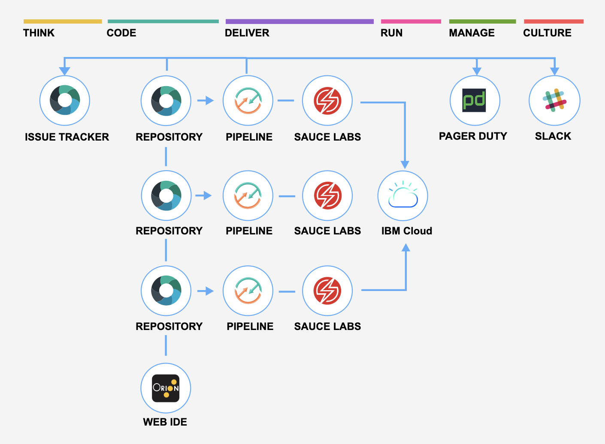

---

copyright:
  years: 2015, 2020
lastupdated: "2021-01-08"

keywords: IBM Cloud Continuous Delivery, getting started, tutorial, create a toolchain, tool integration, toolchain template, DevOps toolchains

subcollection: ContinuousDelivery

---

{:shortdesc: .shortdesc}
{:external: target="_blank" .external}
{:codeblock: .codeblock}
{:pre: .pre}
{:screen: .screen}
{:tip: .tip}
{:note: .note}
{:important: .important}
{:download: .download}
{:help: data-hd-content-type='help'}
{:support: data-reuse='support'}

# Getting started with Continuous Delivery
{: #getting-started}
{: support}

Adopt a DevOps or DevSecOps approach by using {{site.data.keyword.contdelivery_full}}, which includes open toolchains that automate the building and deployment of applications. You can get started by creating a simple deployment toolchain that supports development, deployment, and operations tasks. 
{: shortdesc}

If you already have an instance of {{site.data.keyword.contdelivery_short}}, you can [create a toolchain](https://cloud.ibm.com/devops/create){:external} or [view existing toolchains](https://cloud.ibm.com/devops/toolchains){:external}.
{: tip}

## Prerequisites
{: #cd_prereqs}

Before you can create a continuous delivery toolchain from a template, you must create an instance of {{site.data.keyword.contdelivery_short}} by selecting it from the {{site.data.keyword.cloud_notm}} catalog. The toolchain integrates tools for planning, developing, deploying pipelines, and managing your applications. You can always add or remove tools from your toolchains. If you already have toolchains, you can [view existing toolchains](/docs/ContinuousDelivery?topic=ContinuousDelivery-toolchains_getting_started#viewing_a_toolchain). For more information about working with toolchains, see [Using toolchains](/docs/ContinuousDelivery?topic=ContinuousDelivery-toolchains-using).

## Step 1: Select a toolchain template
{: #select_a_toolchain_template}

To quickly find the toolchain template that addresses your specific requirements, select the appropriate checkboxes to filter by deployment target and tools.
{: tip}

1. On the **Create a Toolchain** page, click a [toolchain template](https://cloud.ibm.com/devops/create){:external}.
1. Review the diagram of the toolchain that you are about to create. The diagram shows each tool integration in its lifecycle phase in the toolchain.

 A few of the toolchain templates have multiple instances of a tool integration. For example, the Microservices toolchain template on {{site.data.keyword.cloud_notm}} Public contains three instances of GitHub and three instances of Delivery Pipeline, one for each of the three microservices.
 {: tip}

 The diagram in the following image is an example. When you create a toolchain, the diagram shows each tool integration that is part of the toolchain.
 
 
## Step 2: Create a toolchain 
{: #create_a_toolchain}
 
1. Review the default information for the toolchain settings:

 * The toolchain's name identifies it in {{site.data.keyword.cloud_notm}}. If you want to use a different name, change the toolchain's name.
 * The region to create the toolchain in. If you want to use a different region, select it from the list of available regions.
 * The resource group or organization to create the toolchain in. Click the link to switch between selecting resource groups and orgs. If you want to use a different resource group or org, select it from the list of available resource groups or orgs.
 * The provider for your source repository, such as GitHub, GitLab, or Bitbucket. If you want to use a different source provider, select it from the list of available repos.
 
   Resource groups are available in the Dallas, Washington, London, Frankfurt, and Tokyo regions. Cloud Foundry orgs are supported in the Dallas, London, and Frankfurt regions.
   {: important}
 
1. In the Tool Integrations section, select each tool integration that you want to configure for your toolchain. A few of the tool integrations do not require configuration. For information about configuring the tool integrations, see [Configuring tool integrations](/docs/services/ContinuousDelivery?topic=ContinuousDelivery-integrations).
1. Click **Create**. Several steps run automatically to set up your toolchain. The tool integrations that are set up are different depending on which toolchain template you selected and whether you are using {{site.data.keyword.cloud_notm}} Public or {{site.data.keyword.cloud_notm}} Dedicated. For example, when you create a Microservices toolchain on {{site.data.keyword.cloud_notm}} Public, these steps are run:

 * The toolchain is created.
 * If you configured Delivery Pipeline, the pipelines are created and run.
 * If you configured Sauce Labs, the toolchain is set up to add Sauce Labs test jobs to the pipelines.
 * If you configured PagerDuty, the toolchain is set up to send alert notifications to the PagerDuty service that you specified.
 * If you configured Slack, the toolchain is set up to send notifications about deployment status to the Slack channel that you specified.
 * If you configured a source code tool integration such as GitHub, the sample GitHub repo is cloned into your GitHub account.

## Next steps
{: #next_steps}

Check out one of these tutorials on the [IBM&reg; Cloud Garage Method](https://www.ibm.com/cloud/garage){:external}:

  * [Create and use your first toolchain by using the "Develop a Cloud Foundry app" toolchain](https://www.ibm.com/cloud/garage/tutorials/introduce-develop-cloud-foundry-app-toolchain){:external}.

  * [Add a toolchain to an app](https://www.ibm.com/cloud/garage/tutorials/add-a-toolchain-to-an-app?task=2){:external}.
  
