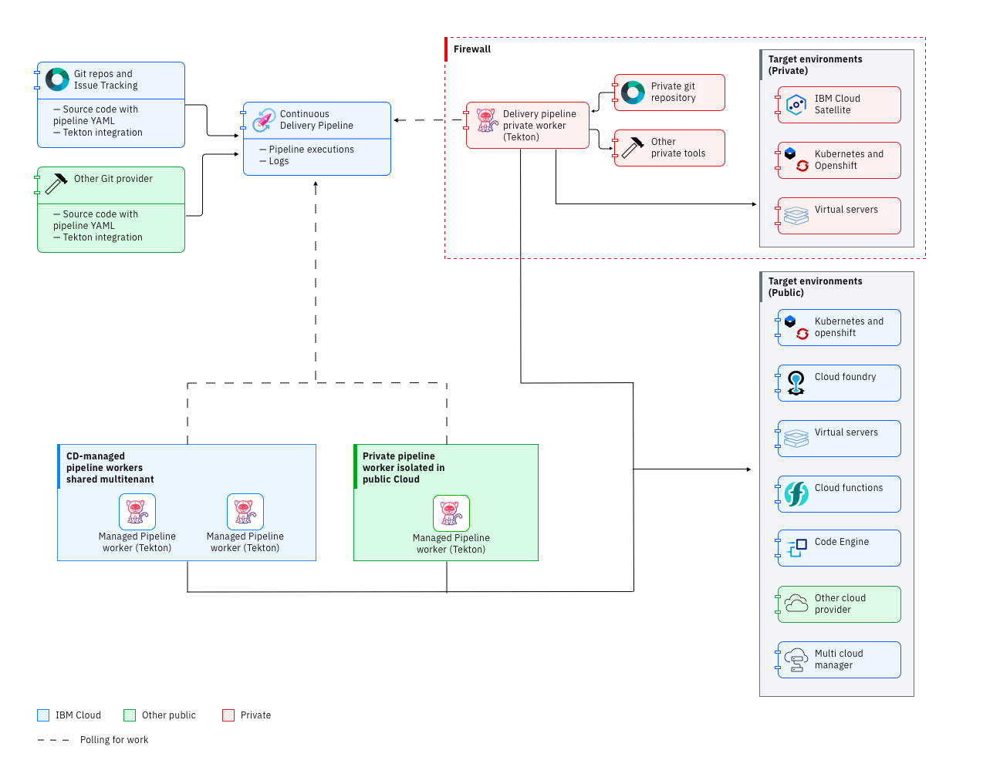
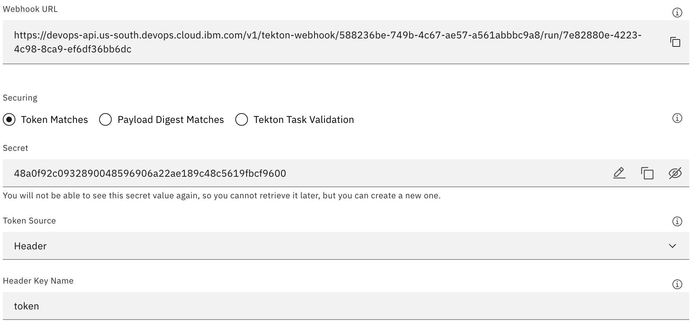
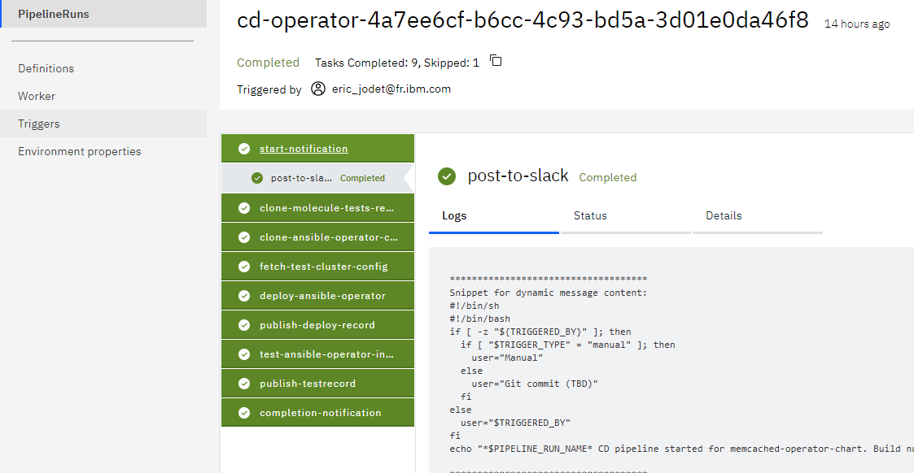

---

copyright:
  years: 2019, 2021
lastupdated: "2021-02-01"

keywords: Tekton integration, delivery pipeline, Tekton delivery pipeline

subcollection: ContinuousDelivery

---

{:shortdesc: .shortdesc}
{:external: target="_blank" .external}
{:codeblock: .codeblock}
{:pre: .pre}
{:screen: .screen}
{:tip: .tip}
{:note: .note}
{:important: .important}
{:download: .download}


# Working with Tekton pipelines
{: #tekton-pipelines}

[Tekton Pipelines](https://tekton.dev/){:external} is an open source project that you can use to configure and run Continuous Integration and {{site.data.keyword.contdelivery_short}} pipelines within a Kubernetes cluster. Tekton pipelines are defined in yaml files, which are typically stored in a Git repository (repo).
{: shortdesc}

 

Tekton provides a set of [Custom Resources](https://kubernetes.io/docs/concepts/extend-kubernetes/api-extension/custom-resources/){:external} extensions to Kubernetes to define pipelines. The following basic Tekton Pipeline resources are included in these extensions:

|Resource |Description	|
|:----------|:------------------------------|
|`Task`		|Defines a set of build steps such as compiling code, running tests, and building and deploying images.		|
|`TaskRun`		|Instantiates a Task for execution with specific inputs, outputs, and execution parameters. Can be invoked on its own or as part of a `Pipeline`.		|
|`Pipeline`		|Defines the set of tasks that compose a pipeline.		|
|`PipelineRun`		|Instantiates a Pipeline for execution with specific inputs, outputs, and execution parameters.		|
| `PipelineResource`		|Defines an object that is an input (such as a Git repository) or an output (such as a Docker image) of the pipeline. This resource was not promoted to [Beta](https://tekton.dev/docs/pipelines/resources/) along with the other Tekton Pipeline custom resources.   		|
{: caption="Table 1. Tekton pipeline resources" caption-side="top"}


There are several advantages to using Tekton Pipelines:

* **Cloud Native**: Tekton Pipelines run on Kubernetes, use Kubernetes clusters as a first class type, and use containers as their building blocks.
* **Decoupled**: You can use one pipeline to deploy to any Kubernetes cluster. You can run the tasks that comprise a pipeline in isolation. And you can switch resources (such as Git repos) between pipeline runs.
* **Typed**: You can switch implementations for specific types of resources, such as images.

The Tekton Pipelines project is a beta release. You must update your pipeline with each new version of Tekton. For more information about the latest version of Tekton, see [https://github.com/tektoncd/pipeline/releases](https://github.com/tektoncd/pipeline/releases){:external}.
{: important}

{{site.data.keyword.contdelivery_full}} provides two types of delivery pipelines that you can use to build, test, and deploy your applications.

* **Classic**: Classic delivery pipelines are created graphically, with the status embedded in the pipeline diagram. These pipelines can run on shared workers in the cloud or on private workers that run on your own Kubernetes cluster. 
* **Tekton**: Tekton delivery pipelines are created within yaml files that define pipelines as a set of Kubernetes resources. You can edit those yaml files to change the behaviour of a pipeline. Tekton pipelines can run on private workers that run on your own cluster. They can also run on IBM-managed workers on the public cloud. The Tekton integration provides a dashboard that you can use to view the output of Tekton pipeline runs. It also provides mechanisms for identifying the pipeline definitions repo, the pipeline triggers, where the pipeline runs, and the storage and retrieval of properties.

When you use IBM-managed workers, only one Tekton pipeline can run per pipeline at a time. When you use private workers, multiple Tekton pipelines can run concurrently.
{: important}

Both types of pipelines isolate jobs or steps from one another by running in separate containers, and by using an image that you choose. Classic and Tekton pipelines both exist in a [toolchain](https://cloud.ibm.com/devops/toolchains){:external} and depend on that toolchain to add more tool integrations that are used in the build, test, and deployment process.
{: tip}

## Prerequisites
{: #tekton_pipelines_prereqs}

Before you add and run a Tekton pipeline, make sure that you have the following resources in place:

* A [toolchain](https://cloud.ibm.com/devops/toolchains) that contains the following tool integrations:

  * A repo tool integration (such as the GitHub tool integration) that contains your Tekton pipeline code, including a Tekton yaml file. Find sample pipeline and task definitions on [github](https://github.com/open-toolchain/hello-tekton). For more information about getting started with Tekton pipelines, see [Tekton Pipelines](https://github.com/tektoncd/pipeline/blob/master/docs/pipelines.md){:external} or take the [Develop a Kubernetes app by using Tekton delivery pipelines](https://www.ibm.com/cloud/architecture/tutorials/develop-kubernetes-app-using-tekton-delivery-pipelines){:external} tutorial.
  * Optional. If you are not using the default shared Pipeline Worker, you can use a {{site.data.keyword.deliverypipeline}} Private Worker tool integration that references your Kubernetes cluster. For more information about private workers, see [Installing Delivery Pipeline Private Workers](/docs/ContinuousDelivery?topic=ContinuousDelivery-install-private-workers).

* [{{site.data.keyword.cloud_notm}} CLI](/docs/cli?topic=cli-install-ibmcloud-cli) installed locally.
* [kubectl](https://kubernetes.io/docs/tasks/tools/install-kubectl/){:external} installed locally.
* A Kubernetes cluster (version 1.15 or higher) such as an [{{site.data.keyword.containerlong}} cluster](https://cloud.ibm.com/kubernetes/catalog/cluster){:external}.

The toolchain and the {{site.data.keyword.deliverypipeline}} Private Worker tool integration must be in the same region. 
{: important}

## Creating a {{site.data.keyword.deliverypipeline}} for Tekton 
{: #create_tekton_pipeline}

When you configure a {{site.data.keyword.deliverypipeline}} tool integration, you can select the type of pipeline that you want to create.

1. If you don't have a toolchain, select a template to [create a toolchain](https://cloud.ibm.com/devops/create){:external}. Depending on the template that you use, different fields might be available. Review the default field values and if needed, change those settings.
1. If you have a toolchain and are adding this tool integration to it, from the {{site.data.keyword.cloud_notm}} console, click the menu icon  and select **DevOps**. On the [Toolchains page](https://cloud.ibm.com/devops/toolchains){:external}, click the toolchain to open its Overview page. Alternatively, on your app's Overview page, on the Continuous delivery card, click **View toolchain**. Then, click **Overview**.
1. Add the Delivery Pipeline integration to your toolchain:

 a. Click **Add tool**.

 b. In the Tool Integrations section, click **{{site.data.keyword.deliverypipeline}}**.

1. Specify a name for your new pipeline.
1. Select **Tekton** to create a Tekton {{site.data.keyword.deliverypipeline}}. This type of pipeline provides a dashboard that you can use to view the output of Tekton pipeline runs on a defined Kubernetes cluster, with support for configuring the pipeline definitions repos, the pipeline triggers, where the pipeline runs, and simple secrets.
1. If you plan to use your pipeline to deploy a user interface, select the **Show apps in the View app menu** checkbox. All of the apps that your pipeline creates are shown in the **View App** list on the toolchain's Overview page.
1. Click **Create Integration** to add the {{site.data.keyword.deliverypipeline}} to your toolchain.

### Configuring a {{site.data.keyword.deliverypipeline}} for Tekton 
{: #configure_tekton_pipeline}

1. Click the **{{site.data.keyword.deliverypipeline}}** card to open the Tekton {{site.data.keyword.deliverypipeline}} dashboard.
1. In the **Definitions** section, complete the following tasks:

 a. Specify the Git repo and URL that contains the Tekton pipeline definition and related artifacts. If your repo is not available, return to the toolchain Overview page and add your repo.

 b. Select the branch within your Git repo that you want to use, or type a tag.
 
 c. Specify the path to your pipeline definition within the Git repo. You can reference a specific definition within the same repo. You can also add multiple definition repos, if they are integrated with the toolchain. 

 d. Save your changes.

 The pipeline definition is updated automatically.
 
1. In the **Worker** section, select the IBM Managed shared worker or the private worker that you want to use to run your Tekton pipeline. For more information about private workers, see [Working with Delivery Pipeline Private Workers](/docs/ContinuousDelivery?topic=ContinuousDelivery-private-workers).

 The private worker must be defined in the same toolchain as your Tekton pipeline.
 {: important}

1. In the **Triggers** section, click **Add trigger** to create a new trigger, and then associate that trigger with an event listener. The list of available event listeners is populated with the listeners that are defined in the pipeline code repo.
 
 Triggers are based on [Tekton trigger definitions](https://github.com/tektoncd/triggers){:external}. Git respository triggers use the event listener that they are mapped to to extract information from the incoming event payload and create Kubernetes resources. These resources are applied to a Tekton `PipelineRun` resource.
 {: tip}

 **Manual triggers** run when you click the **Run** pipeline button and select the trigger.

 **Git repository triggers** run when the specified Git event type occurs for the specified Git repo and branch.
  
 You can access the webhook payload that is delivered to a Git trigger from your Tekton pipeline resources. Although the exact fields are repo-specific, the general syntax for the webhook payload is `$(event.payloadFieldName)`. Before you can create a webhook, you must authorize Git Admin access for the corresponding Git integration. To authorize Git Admin access, [configure and save the Git integration](/docs/ContinuousDelivery?topic=ContinuousDelivery-toolchains-using#configuring_a_tool_integration) again.
 {: tip}

 **Timed triggers** run at a scheduled time that is defined by the [CRON](http://crontab.org/){:external} value. The CRON expression for **timed triggers** is based on the [UNIX crontab syntax](http://crontab.org/){:external} and is a sequence of five time and date fields: `minute`, `hour`, `day of the month`, `month`, and `day of the week`. These fields are separated by spaces in the format `X X X X X`. The maximum frequency for a timed trigger is once every five minutes. The following examples show strings that use various timed frequencies.
   * `*/5 * * * *` - The trigger runs every 5 minutes.
   * `0 * * * *` - The trigger runs at the start of every hour.
   * `0 9 * 1 MON-FRI` - The trigger runs at 9:00 AM every weekday in January.
   * `0 * * NOV,DEC 1` - The trigger runs every hour on Mondays during November and December.

 **Generic webhook triggers** run when a POST request that is configured with the secret setting goes to the generic webhook URL. Generic webhook triggers provide a unique webhook URL for POST requests. You can secure generic webhook triggers to work with Git, a Slack outgoing webhook, an Artifactory webhook, and more by using any of the following methods:

   * Token matches to compare the saved token and the token that is passed within the POST request. Supported token sources include a header, query, or payload. Token matches are used by GitLab webhooks and Slack outgoing webhooks.
   * Payload digest matches to compare the signature and the hash that are generated from the digested payload by using HMAC hex digest with a saved token. Supported signature sources might include a header, query, or payload. Users must specify a digest algorithm. Payload digest matches are used by GitHub webhooks.
   * Tekton task validation requires users to validate the webhook request within their Tekton tasks.

 Specify the following values to use generic webhook triggers with GitHub webhooks:
 
   * Securing: `Payload Digest Matches`
   * Signature Source: `Header`
   * Header Key Name: `X-Hub-Signature`
   * Digest Algorithm: `sha1`.  
 
 Specify the following values to use generic webhook triggers with GitLab webhooks:

  * Securing: `Token Matches`
  * Token Source: `Header`
  * Header Key Name: `X-Gitlab-Token`

 Specify the following values to use generic webhook triggers with Slack outgoing webhooks:

  * Securing: `Token Matches`
  * Token Source: `Payload`
  * JSON Property Name / Form Key: `token`

 The following example shows how to use the curl command with a generic webhook that is secured with a `Token Matches` rule:

   

 ```
 curl -X POST \
  https://devops-api.us-south.devops.cloud.ibm.com/v1/tekton-webhook/588236be-749b-4c67-ae57-a561abbbc9a8/run/7e82880e-4223-4c98-8ca9-ef6df36bb6dc \
  -H 'Content-Type: application/json' \
  -H 'token: 48a0f92c0932890048596906a22ae189c48c5619fbcf9600' \
  -d '{
    "somekey": "somevalue"
  }'
 ```
 To obtain payload values in the pipeline definition, specify a Triggerbinding parameter with a value that is derived from the event:
 
 ```
  apiVersion: tekton.dev/v1beta1
  kind: TriggerBinding
  metadata:
    name: binding
  spec:
    params:
      - name: somekey
        value: $(event.somekey)
 ``` 

Save your changes.

1. In the **Environment properties** section, click **Add property** and define your own environment property. For example, you can define an `API_KEY` property that passes an API key that is used by all of the scripts in the pipeline to access {{site.data.keyword.cloud_notm}} resources. You can add the following types of properties:

 * **Text**: A property key with a single-line value.
 * **Text area**: A property key with a multi-line value.
 * **Secure**: A property key with a single-line value that is secured with AES-128 encryption. This value is displayed by using the asterisk character.
 
 You can access these properties in your Tekton pipeline resources. For more information about these properties, see [Tekton Pipelines environment and resources](/docs/ContinuousDelivery?topic=ContinuousDelivery-tekton_environment).

1. Click **Save**.

## Viewing the {{site.data.keyword.deliverypipeline}} for Tekton dashboard 
{: #view_tekton_dashboard}

In the **PipelineRuns** section, the Tekton {{site.data.keyword.deliverypipeline}} dashboard displays an empty table until at least one Tekton pipeline runs. After Tekton pipeline runs occur (either manually or as the result of external events), the table lists those runs and related information such as status and run trigger, and the last updated time of the run definition.

Pipeline runs can be in any of the following states:

* **Pending**: `PipelineRun` is requested.
* **Running**: `PipelineRun` is running on the cluster.
* **Succeeded**: `PipelineRun` successfully completed on the cluster.
* **Failed**: `PipelineRun` failed. Review the log file for the run to determine the cause.
* **Queued**: `PipelineRun` is accepted for processing and runs when worker capacity is available.
* **Waiting**: `PipelineRun` is waiting to be queued.
* **Cancelled**: `PipelineRun` was cancelled by the system or by the user. The system cancels `PipelineRun` when the number of waiting runs exceeds the allowed limit.
* **Error**: `PipelineRun` contains errors that prevented it from being applied on the cluster. For more information about the cause of the error, see the run details.


For detailed information about a selected run, click any row in the table. You view the `Task` definition and the steps in each `PipelineRun` definition. You can also view the status, logs, and details of each `Task` definition and step, and the overall status of the `PipelineRun` definition.



## Learn more about Tekton pipelines and resources
{: #learn_more_tekton_pipelines}

To learn more about Tekton pipelines, see the [Tekton: A Modern Approach to Continuous Delivery](https://www.ibm.com/cloud/blog/tekton-a-modern-approach-to-continuous-delivery){:external} and [IBM Cloud Continuous Delivery Tekton Pipelines Tools and Resources](https://www.ibm.com/cloud/blog/ibm-cloud-continuous-delivery-tekton-pipelines-tools-and-resources){:external} articles. You can also take this tutorial:

  * [Develop a Kubernetes app by using Tekton delivery pipelines](https://www.ibm.com/cloud/architecture/tutorials/develop-kubernetes-app-using-tekton-delivery-pipelines){:external} tutorial.

To learn more about the Tekton tasks that you can reference within your pipelines, see the [Open Toolchain Tekton Catalog](https://github.com/open-toolchain/tekton-catalog/tree/master/container-registry){: external}. This GitHub repo contains a set of tasks that you can reuse in your Tekton pipelines.
