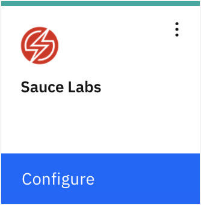
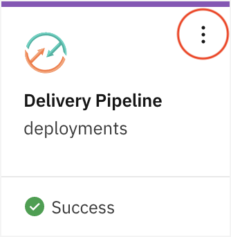

---

copyright:
  years: 2015, 2019
lastupdated: "2019-12-19"

keywords: user management function, toolchains, tool integrations, user access, Cloud Foundry org

subcollection: ContinuousDelivery

---

{:shortdesc: .shortdesc}
{:new_window: target="_blank"}
{:external: target="_blank" .external}
{:codeblock: .codeblock}
{:pre: .pre}
{:screen: .screen}
{:tip: .tip}
{:note: .note}
{:tip: .tip}
{:important: .important}

# Using toolchains
{: #toolchains-using}

Open toolchains are available in the Public and Dedicated environments on {{site.data.keyword.Bluemix}}. You can use a toolchain to be productive in your daily development, deployment, and operations work. After you set up a toolchain, you can add, delete, or configure tool integrations and manage access to the toolchain.
{: shortdesc}

You can manage toolchains in the US South, US East, United Kingdom, Germany, and Tokyo Public regions by using resource groups. You can use Cloud Foundry organizations (orgs) to manage toolchains in the US South, United Kingdom, and Germany Public regions. Access control and authorized user management function differently for toolchains depending on whether they are contained in a resource group or a Cloud Foundry org.
{: important}

## Configuring a tool integration
{: #configuring_a_tool_integration}

If you deferred the configuration of a tool integration when you created a toolchain, a **Configure** button is shown on its card. If you configured a tool integration when you created a toolchain, you can update the configuration settings.

1. On the DevOps dashboard, on the **Toolchains** page, click a toolchain to open its Overview page. Alternatively, on the App details page in your app, click the toolchain name.
1. If you need to configure a tool integration for the first time, on its card, click **Configure**.

  

 When you are finished configuring the tool integration, click **Save Integration**.

1. If you need to update a tool integration's configuration, on its card, click the menu to access the configuration options.

  

 A few of the tool integrations are preconfigured and don't require any configuration parameters. You can update the configuration settings for only the tool integrations that you configured.
 {: tip}

 When you are finished updating the settings, click **Save Integration**. For more information about configuring specific tool integrations, see [Configuring tool integrations](/docs/services/ContinuousDelivery?topic=ContinuousDelivery-integrations).

## Adding a tool integration
{: #adding_a_tool_integration}

You can add and configure tool integrations for your toolchain. The available tool integrations differ depending on whether you use {{site.data.keyword.Bluemix_notm}} Public or {{site.data.keyword.Bluemix_notm}} Dedicated.

1. On the DevOps dashboard, on the **Toolchains** page, click a toolchain to open its Overview page. Alternatively, on the App details page in your app, click the toolchain name.
1. To see a list of tool integrations to add, click **Add a Tool**.
1. Click a tool integration that you want to add.
1. Enter any required information to configure the tool integration.
1. Click **Create Integration** to add the tool integration to your toolchain.

## Deleting a tool integration
{: #deleting_a_tool_integration}

If you delete a tool integration from your toolchain, the deletion cannot be undone.

1. On the DevOps dashboard, on the **Toolchains** page, click a toolchain to open its Overview page. Alternatively, on the App details page in your app, click the toolchain name.
1. On the card for the tool integration that you want to delete, click the menu to access the configuration options.
1. To delete the tool integration from your toolchain, click **Delete**.
1. Confirm by clicking **Delete**.  

## Viewing toolchain connections to apps, clusters, and services
{: #view_toolchain_connections}

You can view your toolchain's connections to Cloud Foundry apps, Kubernetes clusters, and services.

1. On the DevOps dashboard, on the **Toolchains** page, click a toolchain to open its Overview page. Alternatively, on the App details page in your app, click the toolchain name.
1. Select the **Connections** tab, and select the app, cluster, or service that you want to view.

## Managing access to toolchains
{: #managing_access_resource_groups}

You can use the Identity and Access Management (IAM) service to manage user access to toolchains in resource groups. For more information about managing access control with IAM, see [Managing user access to toolchains in resource groups](/docs/services/ContinuousDelivery?topic=ContinuousDelivery-toolchains-iam-security).

You can also grant users access to toolchains by adding them to both the Cloud Foundry org that the toolchain is associated with and the access control list for the toolchain. For more information about granting users access to toolchains in Cloud Foundry orgs, see [Managing user access to toolchains in Cloud Foundry orgs](/docs/services/ContinuousDelivery?topic=ContinuousDelivery-toolchains-cf-security).

Users with access to toolchains might be counted as authorized users of the {{site.data.keyword.contdelivery_full}} service. For more information about how authorized users are counted, see [Plan limitations and usage](/docs/services/ContinuousDelivery?topic=ContinuousDelivery-limitations_usage).

## Organizing toolchains
{: #organizing_toolchains}

You can add tags to your toolchains to organize them and easily find them later. A tag is a label that you assign to a toolchain for easy filtering of toolchains in your toolchains list.

1. On the DevOps dashboard, on the **Toolchains** page, locate the toolchain that you want to add a tag to and click **Add tags**.
1. Enter a name for the tag that you want to add to the toolchain. You can add multiple tags, which are separated by commas.
1. Click **Save**.

For more information about tags, see [Working with tags](/docs/resources?topic=resources-tag#).

## Deleting a toolchain
{: #deleting_a_toolchain}

You can delete a toolchain and specify which of the associated tool integrations you want to delete. When you delete a toolchain, the deletion cannot be undone.

1. On the DevOps dashboard, on the **Toolchains** page, click a toolchain to open its Overview page. Alternatively, on the App details page in your app, click the toolchain name.
1. Click the **More Actions** menu, which is next to **View app**.
1. Click **Delete**. Deleting a toolchain removes all of its tool integrations, which might delete resources that are managed by those integrations.
1. Confirm the deletion by typing the name of the toolchain and clicking **Delete**.  

 When you delete a GitHub, {{site.data.keyword.ghe_short}}, or {{site.data.keyword.gitrepos}} tool integration, the associated repo is not deleted from GitHub, {{site.data.keyword.ghe_short}}, or {{site.data.keyword.gitrepos}}. You must manually remove the repo.
 {: tip}

##Take a tutorial: Using toolchains
{: #toolchain-tutorial}

Check out these tutorials on the [IBM&reg; Cloud Garage Method](https://www.ibm.com/cloud/garage){:external}:

  * [Create and use your first toolchain by using the "Develop a Cloud Foundry app" toolchain](https://www.ibm.com/cloud/garage/tutorials/introduce-develop-cloud-foundry-app-toolchain){:external}.

  * [Add a toolchain to an app](https://www.ibm.com/cloud/garage/tutorials/add-a-toolchain-to-an-app?task=2){:external}.

  * [Use the "Develop and test microservices on Cloud Foundry" toolchain"](https://www.ibm.com/cloud/garage/tutorials/use-develop-test-microservices-on-cloud-foundry-toolchain){:external}.
